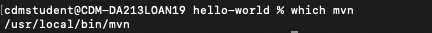
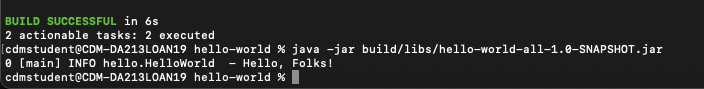

# Instructions
Chadwick Rivera-Crum 1978229

Images are here: [images](images)

**HINT:** Embed your screen captures as requested in the sections below. You can embed the image using the following syntax:

```

```

The first argument is the Alt-text for the image. The second argument is the path to the image. Make sure your images are readable and that you save them in a JPG or PNG format.

# Ant+Ivy [40 pts]
- [5 pts] A screen capture showing the version of Ant that you installed and its install directory.


- [5 pts] A screen capture showing the output generated by the `ant go-nodeps` execution during the Ivy installation.

- [15 pts] A screen capture showing a successful build using the Ant+Ivy script.

- [5 pts] A screen capture showing a successful execution of the JAR file created from the Ant+Ivy build.

- [10 pts] Links to the complete and correct [hello-world/build.xml](hello-world/build.xml) and [hello-world/ivy.xml](hello-world/ivy.xml) files.
- Here: [hello-world/build.xml](hello-world/build.xml) 
- Here: [hello-world/ivy.xml](hello-world/ivy.xml)
# Maven [30 pts]
- [5 pts] A screen capture showing the version of Maven that you installed and its install directory.



- [10 pts] A screen capture showing a successful build using the Maven script.

- [5 pts] A screen capture showing a successful execution of the JAR file created from the Maven build.

- [10 pts] Links to the complete and correct [hello-world/pom.xml](hello-world/pom.xml) file.

- Here: [hello-world/pom.xml](hello-world/pom.xml)
# Gradle [30 pts]
- [5 pts]A screen capture showing the version of Gradle that you installed and its install directory.


- [10 pts] A screen capture showing a successful build using the Gradle script.

- [5 pts] A screen capture showing a successful execution of the JAR file created from the Gradle build.

- [10 pts] Links to the complete and correct [hello-world/build.gradle](hello-world/build.gradle) file.
- Here: [hello-world/build.gradle](hello-world/build.gradle)